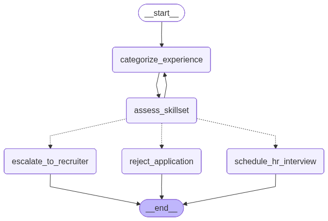

# TalentGateAI Documentation

🚀 **TalentGateAI** is an AI-powered recruitment workflow engine designed to streamline candidate screening and recruiter decision-making.
This repository serves as a **documentation hub** (not the source code) to explain project goals, architecture, and workflows, since the main codebase is kept private.

---

## 🔍 What TalentGateAI Does

TalentGateAI automates the **initial candidate screening process** by:
## 🚀 Features
- Accepts **PDF resumes** or raw text.
- Dynamically **categorizes experience** (`Entry-level`, `Mid-level`, `Senior-level`).
- Evaluates candidate skillset against any **job role** (configurable).
- Decision routing:
  - **Match** → HR interview
  - **Senior-level but No Match** → Escalate to recruiter
  - **No Match** → Auto rejection
- Exports the **workflow graph** as a PNG diagram.
- Modular project structure (nodes, graphs, services, schemas).

---

## 📂 Project Structure
```bash
talentgate/
│── llms/
│   └── groqllm.py           # Groq LLM wrapper (ChatGroq client)
│
│── nodes/
│   ├── categorize_experience.py
│   ├── assess_skillset.py
│   ├── schedule_hr_interview.py
│   ├── escalate_to_recruiter.py
│   └── reject_application.py
│
│── graphs/
│   └── screening.py         # LangGraph workflow definition
│
│── services/
│   └── pdf.py               # PDF text extraction
│
│── schemas.py               # State definition (TypedDict)
│── run.py                   # Entry point (CLI runner)
│── .env                     # Environment variables (ignored in git)
│── requirements.txt
│── README.md
````

---

## ⚙️ Setup

### 1. Clone Repository

```bash
git clone https://github.com/AlekhyaR/talentgate.git
cd talentgate

more details found at : https://github.com/AlekhyaR/TalentGateAI
```
---

## ▶️ Usage

### Run with **text application**

```bash
python run.py --text "I have 10 years of experience in software engineering with expertise in Java" --role "Python Developer"
```

### Run with **PDF application**

```bash
python run.py --pdf "./samples/resume.pdf" --role "Python Developer"
```

### Export Workflow Graph

```bash
python run.py --export-graph
```

---

## 🖼 Example Output

```text
Categorizing the experience level of candidate...
Experience Level: Senior-level

Assessing the skillset of candidate...
Skill Match: No Match

📢 Escalating to recruiter
Response: Candidate has senior-level experience but doesn't match job skills.
```

Graph Diagram (Mermaid exported to PNG):


---

## 📌 Roadmap
*  Enhance rejection workflow
  * [ ] Refine automated rejection emails (tone, templates, personalization).
  * [ ] Integrate calendar scheduling for interviews and recruiter coordination.
* [ ] Refinement in Sending Rejection Emails and calendar integration
* [ ] Add database integration (candidate profiles)
* [ ] Add support for multiple job descriptions
* [ ] Integrate email sending service for auto rejections
* [ ] Web dashboard (Streamlit/FastAPI frontend)

---
